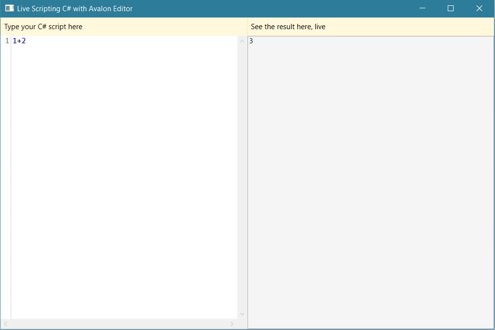

# SodiumSamples

This repository is a collection of examples using [FRP library Sodium](https://github.com/SodiumFRP/sodium) and other technologies.
The purpose is to discuss the examples, their weaknesses and their potential, to learn Sodium together, and maybe to identify APIs on top of Sodium, to capture best practices.

## PongSodium

This is a simple exercise implementing the game Pong with the [C# implementation](https://github.com/SodiumFRP/sodium/tree/master/c%23) of Sodium.
In order to run this WPF application, you need a reference to the Sodium library.

The code provides explanatory comments to guide readers through its logic. As the implementation itself, these comments are subject to discussion, so feel free to provide feedback.

Note that this implementation of Pong makes heavy use of the [Pong example provided by Elm](http://elm-lang.org/examples/pong).
Also, the user [Ziriax](https://github.com/Ziriax) made a significant contribution to how to move the paddles.

## LiveScripting

This project uses Sodium and the C# Scripting package of the [.NET Compiler Platform (a.k.a Roslyn)](https://github.com/dotnet/roslyn). 
You can get this package installed [via NuGet](https://www.nuget.org/packages/Microsoft.CodeAnalysis.CSharp.Scripting).

This application gives you a simple multiline TextBox to enter C# scripts. It will try to compile your input on-the-fly and print the result into the adjacent TextBox (read-only).
If there are compiler errors, it shows the message of the first error instead.

Best thing is to try it out, but if you want to know how it looks like, see here:

  

Over time, more elaborated examples might follow.